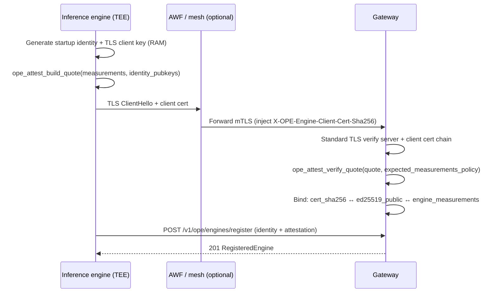
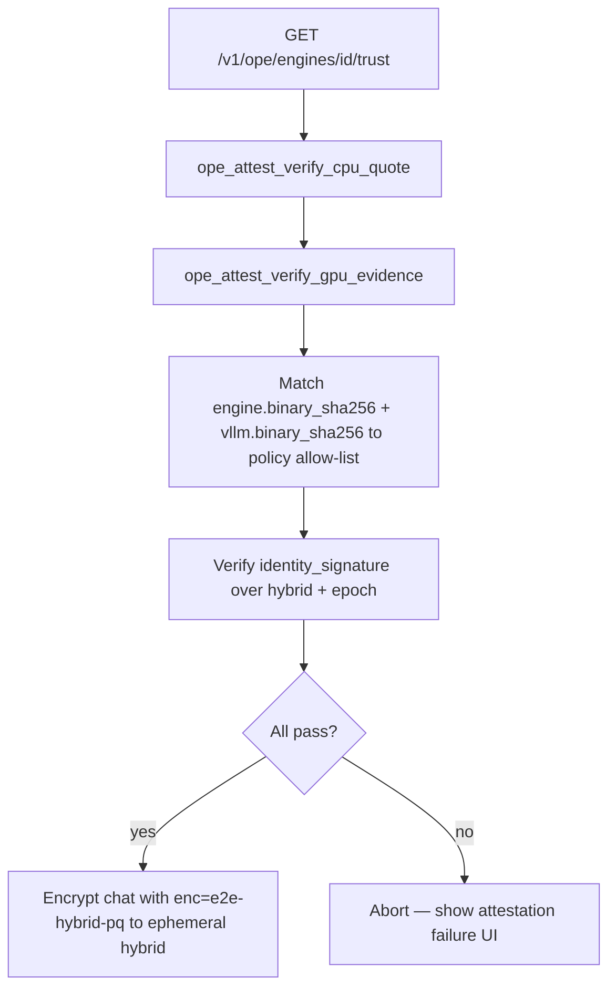
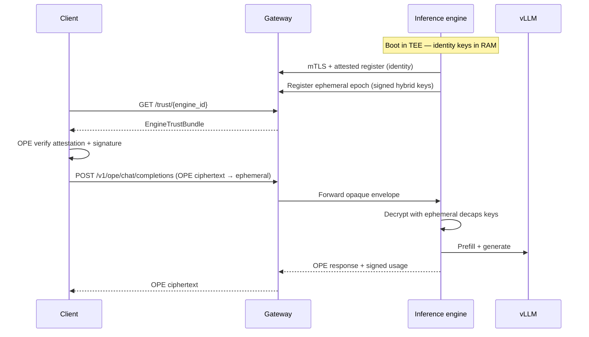

# Inference engine keys, mTLS, and attestation (design review)

Detailed design for **requirement.txt §38–53**: how inference engines obtain and use key material **without KMS or operator access**, how **mTLS + TEE attestation** binds identity to the gateway, how **ephemeral E2E keys** protect long-running engines, and what **clients** must verify before encrypting prompts.

**Related (TeeChat repo):** `docs/design/confidential-ai-runtime.md` · `docs/design/ope-engine-registry.md` · `docs/design/confidential-ai-multi-turn-trace.md` · OPE `vendor/ope/spec/ope-confidential-ai.md`

---

## 1. Goals and constraints

| Requirement | Design response |
|-------------|-----------------|
| Operators must not know engine private keys | Keys generated **inside** CPU TEE (TDX or SEV) at process start; private material never written to disk or config |
| No KMS | No external key import; optional **internal** attested CA only issues **TLS client cert** derived inside TEE |
| Long-running process | **Ephemeral** hybrid E2E keys rotated in memory; **startup identity** only signs ephemerals and usage |
| Gateway trust | **mTLS** + OPE-verified attestation quotes bind TLS cert + `ed25519_public` before registry |
| Client trust | Gateway publishes **verifiable bundle** (TEE + GPU + vLLM + engine hashes + signed ephemeral keys) |

**Split of ownership**

| Concern | OPE library (`vendor/ope`) | TeeChat gateway | Inference engine deploy |
|---------|---------------------------|-----------------|-------------------------|
| Hybrid E2E math, envelope | `ope-e2e`, `ope-envelope` | Forward opaque | Decrypt / encrypt |
| Quote parse/verify (TDX/SEV/GPU) | **`ope-attest`** (to implement) | Policy + cache verdicts | Produce quotes at startup/register |
| mTLS credential binding | Attestation extensions + verify APIs | Registry + AWF thumbprint | Generate TLS client key in TEE |
| HTTP registry, affinity, billing | — | TeeChat `server/confidential-ai/` | This package (`src/`) |

---

## 2. Key hierarchy (two tiers)

```text
┌─────────────────────────────────────────────────────────────────┐
│  Startup identity (lifetime of process, RAM only)                 │
│  • ed25519_identity_sk  → sign ephemerals, usage reports        │
│  • tls_client_sk         → mTLS client authentication to gateway  │
│  • (optional) quote_sealing_key — TEE-specific, not exported      │
└───────────────────────────────┬─────────────────────────────────┘
                                │ signs
                                ▼
┌─────────────────────────────────────────────────────────────────┐
│  Ephemeral E2E session (rotated e.g. every 1–24h, RAM only)      │
│  • mlkem_decaps_sk + mlkem_encaps_pk                            │
│  • x25519_ephemeral_sk + x25519_ephemeral_pk                    │
│  • epoch_id, not_after                                         │
└─────────────────────────────────────────────────────────────────┘
```

### 2.1 Startup identity keys (requirement §1)

**Generation (engine boot, inside TEE):**

1. Process starts in attested enclave / confidential VM.
2. Draw entropy from TEE TRNG (`getrandom` / `RDRAND` inside guest only).
3. Generate:
   - **Ed25519** identity key pair (`ed25519_public` published).
   - **TLS client** key pair (algorithm per deployment: ECDSA P-256 or Ed25519 per TLS stack).
4. Build **TDX/SEV quote** that includes measurement of engine binary + **hash of `ed25519_public` and TLS SPKI** in `REPORT_DATA` or custom claim extension (OPE `ope-attest` defines encoding).
5. Hold private keys **only in heap** marked sensitive; **zeroize** on `SIGTERM` / enclave destroy.

**Prohibited:** writing keys to volume, environment variables, Kubernetes secrets, operator-visible debug endpoints, or KMS wrap.

**Gateway first contact:** identity public keys are learned only after **verified mTLS + attestation** (§4), not from operator-supplied JSON alone.

### 2.2 Ephemeral E2E keys (requirement §4)

**Why:** A compromise after months of uptime must not expose one static ML-KEM decapsulation key for all historical ciphertext. Clients encrypt to **current epoch** keys; old epochs are rejected after TTL.

**Generation (engine, periodic or on demand):**

1. New `epoch_id` (UUIDv7 or monotonic counter).
2. Generate fresh **ML-KEM-768** decaps key + **X25519** key pair (same hybrid as OPE `X25519MLKEM768`).
3. Construct `EphemeralEngineIdentity` public blob (see §6).
4. **Sign** canonical bytes with `ed25519_identity_sk`.
5. `POST` registration to gateway (§5) over existing mTLS connection.

**Client encryption target:** `enc=e2e-hybrid-pq` uses **`engine_mlkem_encap` / `engine_x25519` from the active ephemeral record**, not a multi-month static key. OPE spec §3 “long-lived” is interpreted in TeeChat as **identity binding** (Ed25519 + attestation), not immutability of ML-KEM encap key. OPE library should add a **`ephemeral_epoch`** field to `e2e` in a TeeChat profile addendum.

---

## 3. What the operator never sees

| Asset | Operator-visible? | Client-visible? | Gateway-visible? |
|-------|-------------------|-----------------|------------------|
| `ed25519_identity_sk` | No | No | No |
| `tls_client_sk` | No | No | No |
| `mlkem_decaps_sk` (ephemeral) | No | No | No |
| `ed25519_public` | No (only via attested path) | Yes (in bundle) | Yes |
| TLS client cert SPKI | Fingerprint only (AWF) | No | Cert DER hash |
| Ephemeral hybrid pub keys | No | Yes | Yes |
| TDX/SEV/GPU quotes | No (raw) | Yes (for verify) | Yes (cached verdict) |

---

## 4. Engine → Gateway: mTLS + attestation (requirements §2–3)

### 4.1 Connection establishment



**OPE library responsibilities (`ope-attest`):**

| API (conceptual) | Role |
|----------------|------|
| `build_cpu_tee_quote(bindings)` | Wrap Intel TDX / AMD SEV-SNP evidence |
| `build_gpu_tee_evidence(bindings)` | NV Confidential Computing or equivalent GPU attestation blob |
| `bind_identity_to_quote(quote, ed25519_pub, tls_spki_hash)` | Custom claim / `REPORT_DATA` layout |
| `verify_quote(quote, policy)` | Return `AttestationVerdict { ok, claims, expiry }` |
| `verify_gpu_evidence(gpu_blob, policy)` | GPU TEE measurements |

**TeeChat gateway responsibilities:**

- Terminate or trust AWF-injected `X-OPE-Engine-Client-Cert-Sha256`.
- Call OPE verify **before** accepting registry body.
- Store **verdict + policy version**, not long-term private keys.
- Reject register if quote identity does not match JSON `identity.ed25519_public` or TLS cert binding.

**Measurements in quote (engine builds):**

| Measurement | Source |
|-------------|--------|
| Inference engine binary hash | SHA-256 of running image (in TEE) |
| Engine version string | Build-time `ENGINE_VERSION` |
| vLLM binary hash | Hash of loaded `vllm` executable or container layer |
| vLLM version | `vllm --version` at startup |
| `ed25519_public` | Identity key |
| TLS client SPKI hash | Client cert fingerprint |

---

## 5. Ephemeral key registration (requirement §4)

After mTLS session exists, engine pushes **rotating E2E keys** (may repeat on schedule without full re-register):

```http
POST /v1/ope/engines/register
POST /v1/ope/engines/{engine_id}/ephemeral   (proposed)
```

**Proposed body (`EngineEphemeralRegister`):**

```json
{
  "engine_id": "engine-prod-7",
  "epoch_id": "20260521120000-7f3a",
  "not_before": "2026-05-21T12:00:00Z",
  "not_after": "2026-05-22T12:00:00Z",
  "hybrid": {
    "kex": "X25519MLKEM768",
    "mlkem_encapsulation_key": "<base64url 1184B>",
    "x25519_public": "<base64url 32B>"
  },
  "identity_signature": "<base64url Ed25519 over canonical hybrid + epoch + not_after>",
  "attestation": {
    "cpu_tee": { "...": "fresh or cached quote" },
    "gpu_tee": { "...": "GPU evidence" },
    "vllm": { "version": "0.6.2", "binary_sha256": "..." },
    "engine": { "version": "1.2.0", "binary_sha256": "..." }
  }
}
```

**Gateway:**

- Verifies `identity_signature` with stored `ed25519_public` from initial register.
- Re-validates attestation if epoch rotation exceeds policy staleness.
- Maintains `active_epoch` per `engine_id` (+ optional overlap list for grace period).
- Does **not** store any private key.

**Canonical signing bytes (engine + OPE):**

```text
"OPE-ENGINE-EPHEMERAL-v1" || engine_id || epoch_id || not_after ||
  mlkem_encapsulation_key || x25519_public
```

---

## 6. Gateway → Client: discovery (requirement §4–5)

Authenticated clients fetch trust material **before** encrypting a conversation:

```http
GET /v1/ope/engines/{engine_id}/trust
Authorization: Bearer <user-jwt>
```

**Response (`EngineTrustBundle`):**

```json
{
  "engine_id": "engine-prod-7",
  "epoch_id": "20260521120000-7f3a",
  "not_after": "2026-05-22T12:00:00Z",
  "hybrid": {
    "kex": "X25519MLKEM768",
    "mlkem_encapsulation_key": "...",
    "x25519_public": "..."
  },
  "identity": {
    "ed25519_public": "...",
    "identity_signature": "..."
  },
  "attestation": {
    "cpu_tee": {
      "kind": "tdx|sev-snp",
      "quote": "<base64>",
      "verdict": "pass",
      "policy_id": "teechat-cpu-tee-v1"
    },
    "gpu_tee": {
      "kind": "nv-cc|amd-...",
      "evidence": "<base64>",
      "verdict": "pass"
    },
    "vllm": {
      "version": "0.6.2",
      "binary_sha256": "hex"
    },
    "engine": {
      "version": "1.2.0",
      "binary_sha256": "hex"
    }
  },
  "gateway_cached_at": "2026-05-21T12:05:00Z"
}
```

Gateway may pre-verify quotes at register time and return **verdict + opaque quote** so clients re-verify or trust gateway policy (product decision: **recommend client-side OPE verify** for strongest model).

---

## 7. Client verification flow (requirement §5)



| Check | OPE library | Client UI |
|-------|-------------|-----------|
| TDX or SEV quote signature + freshness | `verify_quote` | Show CPU TEE status |
| GPU TEE evidence | `verify_gpu_evidence` | Show GPU confidential status |
| vLLM version + hash in allow-list | Policy file / remote config | Display model stack version |
| Engine version + hash | Policy file | Display engine build |
| Ephemeral signature | `ope-envelope` Ed25519 verify | Bind epoch to identity key |
| `not_after` | Clock skew window | Refuse expired epoch |

After verification, client includes in envelope `e2e`:

```json
{
  "kex": "X25519MLKEM768",
  "client_share": "<ephemeral client hybrid>",
  "engine_mlkem_encap": "<from trust bundle>",
  "engine_x25519": "<from trust bundle>",
  "ephemeral_epoch": "20260521120000-7f3a"
}
```

Gateway checks `engine_id` + `ephemeral_epoch` maps to active registration (metadata only).

---

## 8. End-to-end lifecycle (startup → chat)



**Multi-turn:** same `engine_id` + **same `epoch_id`** until rotation; affinity unchanged ([multi-turn trace](./confidential-ai-multi-turn-trace.md)).

**Epoch rotation mid-conversation:** gateway returns `409 epoch_expired`; client refetches `/trust`, re-encrypts pending message (app policy).

---

## 9. Rotation and revocation

| Event | Action |
|-------|--------|
| Scheduled rotation | Engine registers new `epoch_id` **before** `not_after`; gateway keeps **N=2** active epochs for 15 min overlap |
| Process restart | New startup identity → full mTLS re-register; all prior ephemerals invalidated |
| Attestation failure | Gateway marks engine unhealthy; no new client trust |
| Compromise suspicion | Operator drains engine from LB only — **cannot** rotate keys without new attested instance |

---

## 10. Implementation status

| Requirement area | Status | Code |
|------------------|--------|------|
| Attestation verify (mock) | **Implemented** | `src/attestation.ts` |
| Ephemeral signing verify | **Implemented** | `src/ephemeral.ts` |
| Client trust bundle | **Implemented** | `src/client-trust.ts` |
| Mock engine keys | **Implemented** | `src/testing/mock-keys.ts` |
| Gateway register / trust / chat | **Implemented** | TeeChat `server/confidential-ai/` |
| Production TDX/SEV/GPU quotes | **Planned** | OPE `ope-attest` in consuming repo |

```bash
pnpm test          # this package
# TeeChat: pnpm exec vitest run server/confidential-ai
```

---

## 11. OPE library scope (explicit)

Implement in **`vendor/ope`** only:

- Quote encoding/decoding (TDX, SEV-SNP).
- GPU TEE evidence format.
- Identity ↔ quote binding.
- Signature algorithm for ephemeral binding.
- **No** HTTP servers, registry, or vLLM calls.

Implement in **TeeChat gateway:**

- Registry schema, `/trust` API, epoch table, policy IDs.
- mTLS integration with AWF headers.

Implement in **inference engine binary** (separate repo/image):

- TEE keygen at boot.
- vLLM invocation + OPE decrypt/encrypt.
- Register + rotate ephemerals.

---

## 12. Threat notes

| Threat | Mitigation |
|--------|------------|
| Operator reads key files | No persistence; TEE sealing only for non-exportable sealing if needed |
| Gateway learns prompts | OPE E2E to ephemeral; gateway sees metadata only |
| Stale compromised epoch | Short TTL + client `not_after` check |
| Fake engine with valid TLS but wrong code | Quote must include binary hashes; client policy |
| GPU outside TEE | GPU TEE evidence required in bundle for confidential GPU path |
| Binary ≠ published source | Reproducible build + archived deps; match `engine.binary_sha256` — [reproducible-builds-and-source-retention.md](./reproducible-builds-and-source-retention.md) |

---

## 13. Review checklist

- [ ] Agree ephemeral E2E vs static key in OPE spec (TeeChat profile addendum).
- [ ] Confirm TLS client key is generated in TEE, not operator-issued PEM.
- [ ] Define `ope-attest` quote layout for TDX + SEV + GPU vendors you ship.
- [ ] Define allow-list source for vLLM/engine hashes (gateway config vs transparency log).
- [ ] Decide client must re-verify quotes vs trust gateway `verdict` field.
- [ ] Approve proposed `POST .../ephemeral` and `GET .../trust` routes.

---

## 14. Open questions for product

1. **Overlap window** for epoch rotation (default 15 min?).
2. **Internal CA** for mTLS client certs vs raw public-key TLS client auth.
3. Whether **gateway** re-attests on every ephemeral register or trusts recent CPU quote cache.
4. **Guest users**: block confidential path until attestation UI is implemented?
